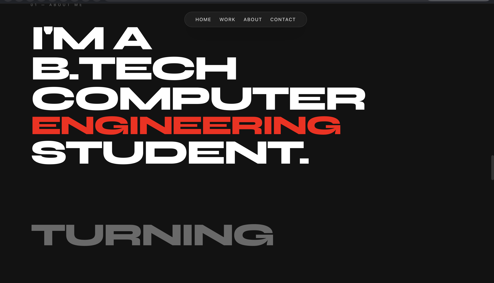
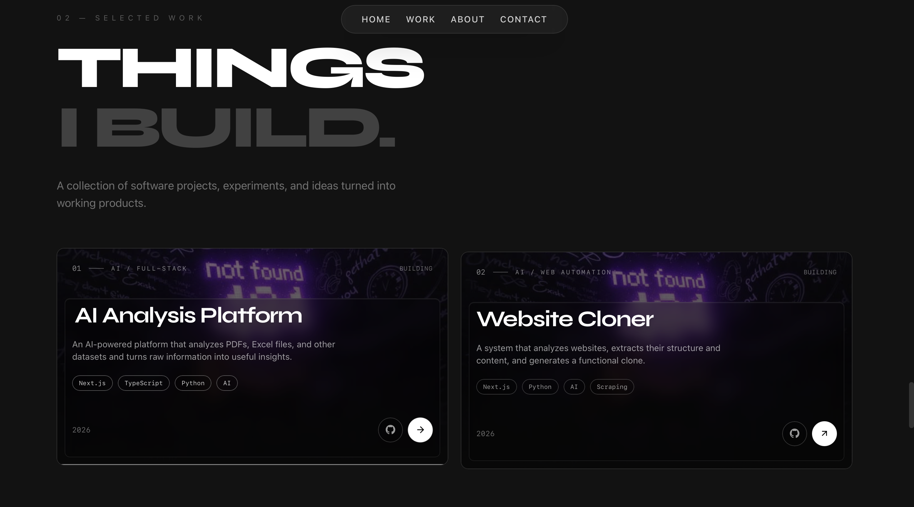
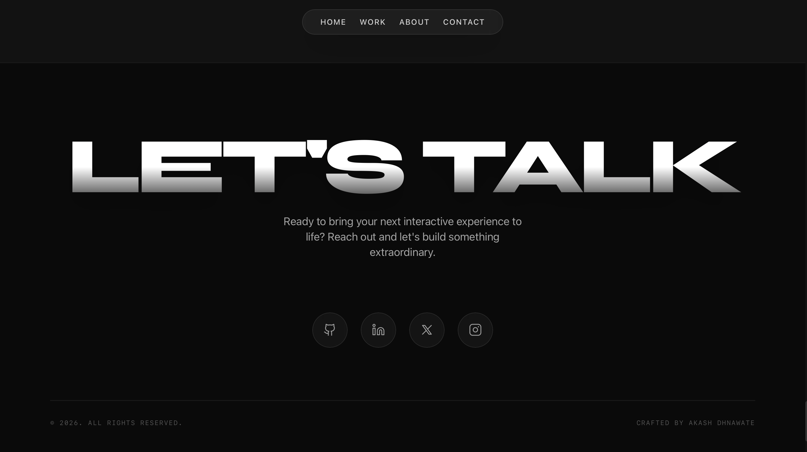

# 🚀 CodeWithSky — Personal Portfolio

<div align="center">


<br/>

# 👨‍💻 Akash Dhanwate

### B.Tech AI & Data Science Student • Developer • ML Enthusiast

Building projects, learning technologies, and turning ideas into working products.

<br/>

<a href="https://codewithsky.site">
  
</a>

<a href="https://github.com/Akash-Dhanwate">
  
</a>

</div>

---

## 🌐 Live Portfolio

### 🔗 [codewithsky.site](https://codewithsky.site)

**CodeWithSky** is my personal developer portfolio where I showcase my projects, technical skills, development experience, and journey as an Artificial Intelligence & Data Science student.

The portfolio is built to be more than a traditional resume — it represents the things I build, the technologies I work with, and the problems I enjoy solving.

---

# 📸 Portfolio Preview

<div align="center">

### 🏠 Home


<br/><br/>

### 👨‍💻 About



<br/><br/>

### 🛠️ Skills



<br/><br/>

### 🚀 Projects


<br/><br/>

### 📬 Contact



</div>

---

# 🎯 About The Project

**CodeWithSky** is a personal portfolio website designed and developed to represent my journey as a developer and Artificial Intelligence & Data Science student.

The website brings together my:

- 👨‍💻 Development projects
- 🤖 Artificial Intelligence interests
- 🧠 Machine Learning work
- 📊 Data Science projects
- 🛠️ Technical skills
- 🎓 Education
- 🚀 Development journey
- 📬 Contact information

Instead of functioning as a static resume, the portfolio is designed as an interactive digital profile that allows visitors to explore my work and technical journey.

---

# ✨ Features

### 🎨 Modern UI

A clean and modern developer-focused interface designed around readability, visual hierarchy, and easy navigation.

### 📱 Responsive Design

The portfolio is designed to provide a consistent experience across:

- 💻 Desktop
- 🖥️ Laptop
- 📱 Mobile
- 📟 Tablet

### 🚀 Project Showcase

Projects are presented with relevant information including:

- Project overview
- Technologies used
- Features
- Source code
- Live demonstrations

### 🧑‍💻 Developer Profile

Dedicated sections for:

- About Me
- Technical Skills
- Projects
- Education
- Experience
- Contact

### ⚡ Fast Experience

Built using modern frontend technologies with a focus on performance and smooth navigation.

### 🌐 Production Deployment

The portfolio is deployed and publicly accessible at:

**https://codewithsky.site**

---

# 🧠 What This Project Demonstrates

This project represents more than just a portfolio website.

### ⚛️ Frontend Development

Building modern and responsive interfaces using React and Next.js.

### 🧩 Component-Based Architecture

Creating reusable components that keep the application organized and maintainable.

### 🎨 UI / UX

Applying principles of:

- Layout
- Typography
- Spacing
- Responsiveness
- Navigation
- Visual hierarchy

### 🔧 Git & Version Control

Using Git and GitHub for:

- Version control
- Branch management
- Feature development
- Project history
- Repository management

### ☁️ Deployment

Taking a project from local development to a publicly accessible production website.

### 🪪 Personal Branding

Creating a consistent digital identity around my technical work, projects, and interests.

---

# 🛠️ Tech Stack

<div align="center">

| Technology | Purpose |
|------------|---------|
| ⚛️ React | User interface development |
| ▲ Next.js | React framework and application architecture |
| 🎨 Tailwind CSS | Styling and responsive design |
| 🟨 JavaScript / TypeScript | Application logic |
| 🌐 HTML5 | Semantic structure |
| 🎨 CSS3 | Styling and layout |
| 🐙 Git | Version control |
| 🐙 GitHub | Source code hosting |
| ☁️ Vercel | Deployment |

</div>

---

# 📂 Project Structure

```text
CodeAlpha_Portfolio/
│
├── public/
│   ├── screenshots/
│   │   ├── home.png
│   │   ├── about.png
│   │   ├── skills.png
│   │   ├── projects.png
│   │   └── contact.png
│   │
│   └── ...
│
├── src/
│   ├── app/
│   ├── components/
│   └── ...
│
├── .gitignore
├── package.json
├── package-lock.json
└── README.md
